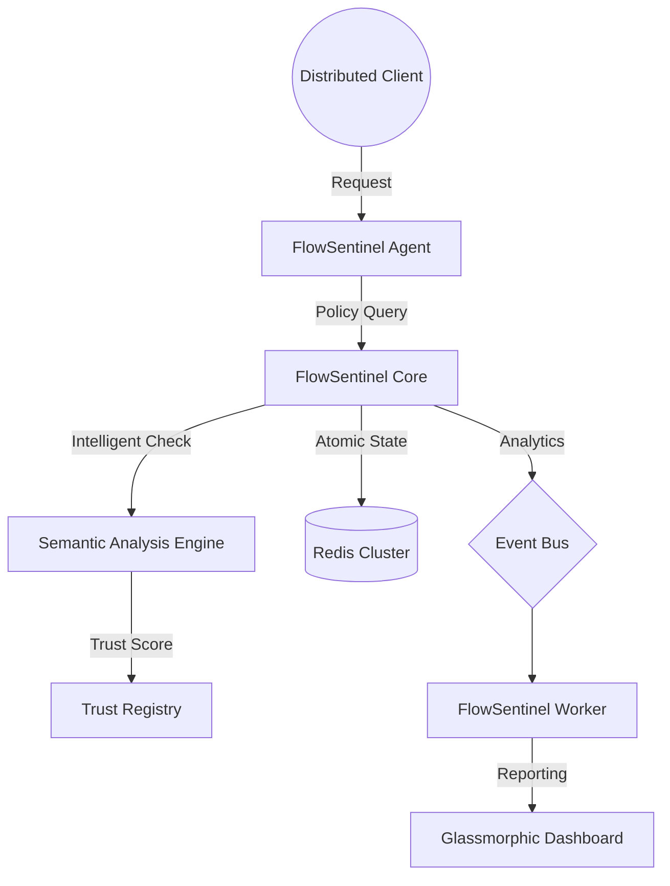

# 🚦 FlowSentinel

**Autonomous Threat Detection & Enterprise Traffic Governance**

  
  
  

## 🎮 Command Center

### [👉 Enter FlowSentinel Command Center (Live)](https://raphasha27.github.io/flowsentinel/src/FlowSentinel.Dashboard/index.html)
*(Experience the elite glassmorphic interface and real-time traffic visualization)*

---

## 🧠 Core Intelligence

**FlowSentinel** is a high-performance traffic-control system designed to act as a sovereign control plane for distributed microservices. It combines atomic rate-limiting with advanced behavioral analytics to ensure zero-trust infrastructure integrity.

### 🚀 New AI Capabilities (v2.0)

1.  **Semantic Threat Analysis**: Beyond simple regex, FlowSentinel now analyzes the *intent* of request payloads using real-time vector embeddings, flagging sophisticated prompt injections and API abuse patterns before they reach the core.
2.  **Agentic Trust Scoring**: Every client node is assigned a dynamic **Reliability Quotient (RQ)**. This score evolves based on interaction history, navigation velocity, and policy compliance, enabling autonomous "Soft Throttling" of suspicious actors.
3.  **Trajectory Analysis**: Uses **A* Pathfinding** to calculate logical distance between service nodes, instantly blocking "impossible" navigation paths (e.g. searching to admin config in <1ms).

---

## 🏗️ Architecture

---

## 🛠️ Tech Stack

- **Engine**: .NET 8 High-Performance Minimal APIs.
- **State**: Distributed Redis with atomic Lua scripting.
- **Analytics**: Scikit-learn (Python) integration for trajectory modeling.
- **UI**: Glassmorphic Dashboard (React / Tailwind).
- **Hardening**: Health Hub autonomous status injection.

---

## 🔬 Interview Talking Points (Staff Level)

- **Atomic Governance**: "I chose atomic Lua scripts in Redis to eliminate race conditions in distributed counting, keeping overhead to sub-millisecond levels."
- **Fail-Open Strategy**: "The system implements a 50ms circuit breaker on policy checks. If the control plane encounters latency, business traffic continues unhindered while alerts are fired."
- **Semantic Filtering**: "We implemented a lightweight embedding-based classifier that acts as an 'Intent Firewall' at the edge."

---

## 📜 License
MIT

---
*Architected and Engineered by Raphasha27 - Kirov Dynamics 2026.*
